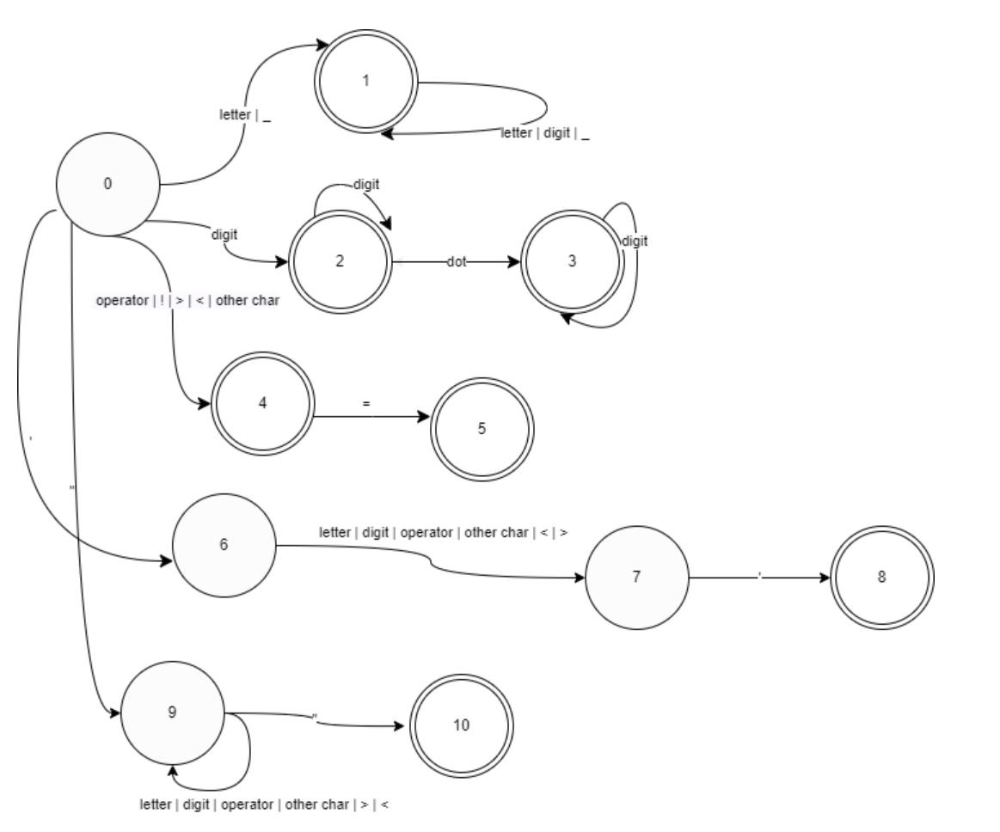

# Lexical-Analyzer
This Project is the SEU CSE's (Dr. Qi)Compile principle class's Lab 1(Lexical Analyzer).


## Keywords
| KeyWord | Tag |
| ------|------|
| main |MAIN|
| if|IF|
|then|THEN|
|while|WHILE|
|do|DO|
|static|STATIC|
|int|INT|
|double|DOUBLE|
|struct|STRUCT|
|break|BREAK|
|else|ELSE|
|long|LONG|
|switch|SWITCH|
|case|CASE|
|typedef|TYPEDEF|
|char|CHAR|
|return|RETURN|
|const|CONST|
|float|FLOAT|
|short|SHORT|
|continue|CONTINUE|
|for|FOR|
|void|VOID|
|default|DEFAULT|
|sizeof|SIZEOF|

## Operator
| Tag | Operator|
|------|------|
|LT|<|
|GT|>|
|EQ|==|
|GTE|>=|
|LTE|<=|
|NEQ|!=|
|PLUS|+|
|MINUS|-|
|MULTIPLY|*|
|DIVIDE|/|
|MOD|%|
|ASSIGN|=|

## Other Characters
|Tag | Character |
|------|------|
| PREPREOCESS DIRECTIVE| # |
| DELIMITER | ; |
## Regular Experession
```
letter -> a | ··· | z | A | ··· | Z
digit -> 0 | ··· | 9
dot -> .
ID -> (letter | _ )(letter | digit | _ )*
NUM -> digit dot ? digit*
operator ->  + | - | * | / | % | = 
relation operator ->  >= | <= | == | != | < | >
other char -> # | ;
SINGLE CHAR -> ' letter | digit | operator | other char | < | > '
STR -> " (letter | digit | operator | other char | < | >)* "
```
## The Reduced Deterministic Finite Automata 


## Supplement
* This lexical analyzer only can analyse part of C source program.
* Once it met the error status, it **exit** and **scan next character**.
* Default it analyses the ```Input.txt``` , and output the result to the ```output.txt```.

